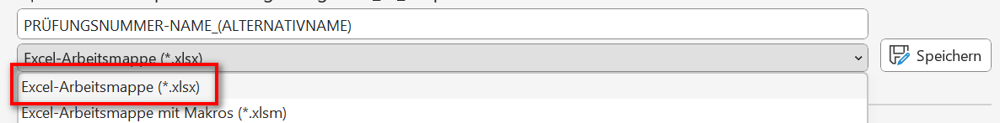
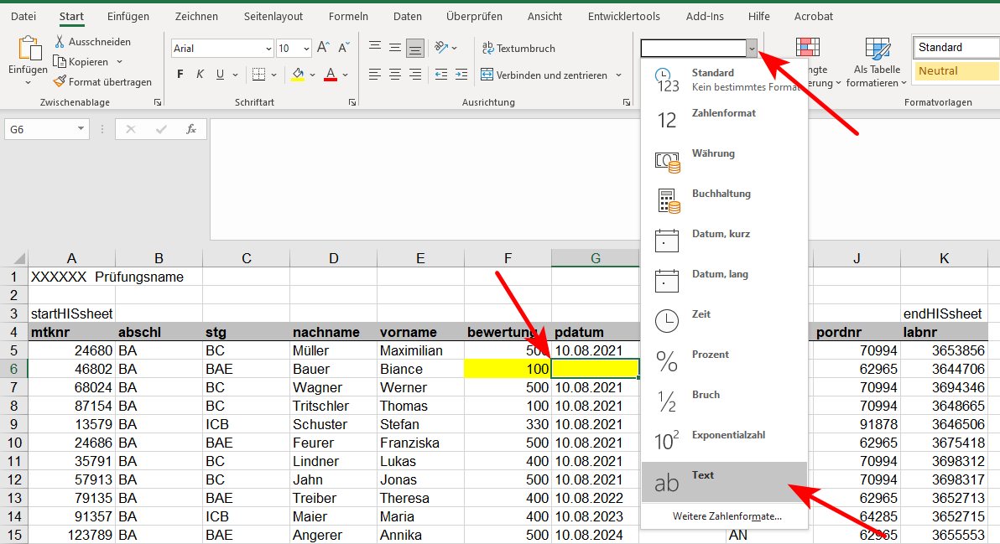

# grades_to_hisqis

Kann die Noten aus einer eigens erstellten Excel-Tabelle in den Export von HisQis eintragen, sodass dieser direkt hochgeladen werden kann, um die Noten einzuspielen.


## Anleitung
1. Zuerst auf HisQis anmelden, die Prüfung auswählen und auf der Seite in der die Tabelle angezeigt wird ganz nach unten Scrollen und den Button `[Excel-Export` drücken
    Es sollte eine Datei mit dem Namensschema `prf_XXXXXX_XXXXX_1.xls` herunterladen werden; Diese Datei ist die im Programm als ***HisQis-Datei*** bezeichnete Datei

  

2. Anschließend öffnen Sie das Programm *grades_to_hisqis*

   

3. ```batch
   Bitte von HisQis heruntergeladene Export-Datei (XLSX) auswählen
   <<ENTER-Taste drücken um Dialog zu öffnen>>
   ```
   ==> Drücken Sie die ENTER-Taste und wählen Sie in dem sich öffnenden Dialog die Datei, die Sie gerade aus HisQis heruntergeladen haben (die `PRÜFUNGSNUMMER-NAME_(ALTERNATIVNAME).xlsx`)

   

4. ```batch
   Bitte eigene Datei auswählen
   <<ENTER-Taste drücken um Dialog zu öffnen>>
   ```
   ==> Wählen Sie nun Ihre eigene Excel-Datei aus, die die Matr.-Nr. und die Noten enthält *(Achtung, es wird nur XLSX unterstützt!)*

   

5. Ihre Excel-Datei wird daraufhin eingelesen.
   

   ```batch
   Ihre Excel-Datei enhält folgende Tabellenblätter: 
   0	Noten
   1	Sonstiges
   2	Tabelle3
   
   Welche Nummer (links) trägt das Tabellenblatt, das die Noten enhält? 
   ```

   Sollen diese mehrere Tabellenblätter enthalten (in diesem Beispiel *Noten*, *Sonstiges* und *Tabelle3*) fragt Sie das Programm, in welcher dieser Blätter sich die Noten befinden.

   Geben Sie daraufhin die Nummer die sich links befindet an, in diesem Beispiel die **0** bei *Noten*.

   

6. Danach wird das Excel-Blatt eingelesen.
   

   ```
                       0   1               2   ...             7  ...   15                  16
   0             WS 20/21 NaN             NaN  ...            NaN ...  NaN                 NaN
   1   Management Science NaN             NaN  ...  Notenspiegel: ...  NaN                 NaN
   2                  NaN NaN               1  ...            2.7 ...  4.0                 NaN
   3              Schnitt NaN               2  ...              7 ...  3.7                 NaN
   4             3.695876 NaN               5  ...             18 ...  3.3                 NaN
   5                  NaN NaN        0.020619  ...       0.072165 ...  3.0                 NaN
   6                  NaN NaN        0.051546  ...       0.185567 ...  2.7                 NaN
   7       Durchfallquote NaN             NaN  ...            NaN ...  2.3                 NaN
   8             0.410526 NaN             NaN  ...            NaN ...  2.0                 NaN
   9                  NaN NaN             NaN  ...            NaN ...  1.7                 NaN
   10                 NaN NaN             NaN  ...            NaN ...  1.3                 NaN
   11                 NaN NaN             NaN  ...            NaN ...  1.0                 NaN
   12                 NaN NaN             NaN  ...            NaN ...  NaN                 NaN
   13                 NaN NaN             NaN  ...            NaN ...  NaN                 NaN
   14                 NaN NaN          Punkte  ...             10 ...  NaN                 NaN
   15                 NaN NaN  Matrikelnummer  ...         Task 5 ...  NaN  Grade conventional
   16                 NaN NaN           87081  ...              9 ...  NaN                   5
   
   
   In welcher Zeilenzahl (links) befindet sich der Tabellenkopf in der oben angezeigten Tabelle? 
   ```
   
   **Achtung: Sie müssen zur Bedienung des Programms Ihre Excel-Datei mit den Noten nicht öffnen, der Auszug dient oben nur zur Illustration und zum besseren Verständnis!**
   
   Wie im oberen Beispiel ersichtlich, enthält das Excel-Blatt noch einige weitere Informationen im Kopf, bevor die eigentliche Liste/Tabelle mit den Noten beginnt. Die eigentlich Liste/Tabelle beginnt wie in rot markiert in der **Excel**-Zeile 16. 
   
   Sie müssen nun diese Zeile in der verkürzten Ausgabe des Programms suchen und angeben. In diesem Beispiel handelt es sich hier um die Zeile **15**, die Sie daran erkennen können, dass sich die Zelle _Matrikelnummer_ und _Grade conventional_ in ihr befinden.
   
   *Tipp: Diese Zeilennummer stimmt immer mit der Excel Zeile -1 (16-1=15) überein, achten Sie jedoch darauf, dass dies **nur hier** so ist, für die anderen Zeilenzahlen die das Programm abfrägt stimmt diese Regel nicht mehr!*
   
   
   
7. Anschließend müssen Sie dem Programm helfen Ihre Spalten mit denen der HisQis-Datei abzugleichen.

   ```batch
   Ihre Tabelle enhält folgende Spalten:
   0	Unnamed: 0
   1	Unnamed: 1
   2	Matrikelnummer
   3	Task1
   4	Task 2
   5	Task 3
   6	Task 4
   7	Task 5
   8	Task 6
   9	Unnamed: 9
   10	Unnamed: 10
   11	Unnamed: 11
   12	Unnamed: 12
   13	Total
   14	Grade
   15	Unnamed: 15
   16	Grade conventional
   
   Diese müssen Sie den Spalten von HisQis zuordnen.
   ```

   Hierzu fragt das Programm die einzelnen benötigten Spalten ab. Geben Sie dabei immer die Nummer an, die Sie ganz links in der Ausgabe des Programms sehen.

   

   1. Matr.-Nr.-Spalte angeben

      ```batch
      Was ist die Nummer (links) Ihrer Spalte für Matrikelnummer (in HisQis: "Matrikelnummer")? 
      ```

      In diesem Beispiel **2**, da die mit *Matrikelnummer* benannte Spalte die Matr.-Nr. enthält.

   2. Noten-Spalte angeben

      ```batch
      Was ist die Nummer (links) Ihrer Spalte für Leistung/Bewertung/Note (in HisQis: "Leistung")? 
      ```

      In diesem Beispiel **16** (oder alternativ 14), da die Spalte *Grade conventional* die Noten enthält (bzw. alternativ die als *Grade* benannte Spalte)

   3. Prüfungsdatum -- **AKTUELL DEAKTIVIERT!**

      ```batch
      Hat Ihre Tabelle eine Prüfungsdatum-Spalte (in HisQis: "pdatum")? [1 = ja, 0 = nein] 
      ```

      Anschließend wird noch abgefragt, ob Ihre Tabelle eine Spalte enthält, in der sich das Prüfungsdatum befindet (was z.B. bei Seminarabgaben häufiger der Fall ist). Falls **ja** wählen Sie **1**, falls **nein**, wählen Sie **0**.
      Sollten Sie **0** gewählt haben, können Sie das Prüfungsdatum per Hand eingeben.

      ```batch
      Bitte geben Sie den Festwert für Prüfungsdatum (in HisQis: "pdatum") ein:
      ```

      *Tipp: Sollten Studierende die Prüfungsleistung nicht angetreten haben findet sich in der Tabelle in HisQis (sowohl online wie in der HisQis-Excel-Export-Datei) bereits das Prüfungsdatum, das Sie so übernehmen können*

      

8. Anschließend ist anzugeben, wo sich die letzte Zeile der eigentlichen Tabelle befindet. (Dies ist normalerweise zwar die letzte Zeile, jedoch beinhalten manche Excel-Vorlagen noch weitere Zeilen die mit Nullen gefüllt sind, die jedoch nicht vom Programm berücksichtigt werden sollen)

   ```batch
       Matrikelnummer  Task1  ...  Grade conventional
   93           98765      3  ...                 1,7
   93           87654      3  ...                 3,3
   94           76543      9  ...                 5,0
   95           65432      7  ...                 3,0
   96           54321      0  ...                 2,3
   
   Bei welcher Zeilenzahl (links) endet der Inhalt der oben angezeigte Tabelle? 
   ```
   
   Geben Sie hier die letzte Zeilenummer an, die links angezeigt wird, die noch Noten enthält. In diesem Beispiel **96**.


9. Matr.-Nr. stimmen ggf. nicht überein.

   ```batch
   ╔══════════════════════════════════════════════════════════════════════╗
   ║ WARNUNG!!!                                                           ║
   ║ ----------                                                           ║
   ║ Matrikelnummern stimmen nicht überein!                               ║
   ║                                                                      ║
   ║ Zusätzliche in HisQis-Datei: 24680, 46802, 68024                     ║
   ║ Zusätzliche in eigener Datei: 13579, 24686, 35791, 57913             ║
   ╚══════════════════════════════════════════════════════════════════════╝
   ```

   Hier zunächst als Erklärung:

   - Zusätzliche Matr.-Nr. in der HisQis-Datei sind in der Regel kein Problem, die sind meist die Studierenden, die nicht zur Prüfung angetreten sind.

   - Eher problematisch sind die überschüssigen Nummern in Ihrer eigenen Datei. Hierbei handelt es sich normalerweise um falsch eingetippte Matr.-Nr. oder ein Student hat sich unter einer anderen Prüfungsnummer angemeldet, dies müssen Sie manuell überprüfen.

     **Achtung**: Sollten Sie in Ihrer eigenen Datei z.B. einen Tippfehler bei der Matr.-Nr. ausbessern reicht es **nicht** die Excel-Datei abzuspeichern, sondern Sie müssen das Programm daraufhin schließen und nochmals neu Starten (= bei Schritt 2 beginnen.)

   

   Optionen:

   ```batch
   Wie soll hiermit verfahren werden?
   0	Nur die Matrikelnummern der HisQis-Datei berücksichtigen
   1	Nur die Matrikelnummern der eigenen Datei berücksichtigen
   2	Nur die Matrikelnummern berücksichtigen, die in beiden Dateien enthalten sind
   3	Die Matrikelnummern aus beiden Dateien berücksichtigen
   4	Mehr Details anzeigen 
   ```

   

   1. Generell empfiehlt es sich immer, noch einen kurzen Blick auf die Unstimmigkeiten zu werfen, indem man **4** wählt. Daraufhin werden diese entsprechenden Tabellenzeilen genauer aufgelistet

      

      Zusätzliche Matr.-Nr. in der HisQis-Datei

      ```batch
      Zusätzlich in HisQis-Datei:
      ===========================
            mtknr       nachname        vorname  bewertung pstatus
      2     24680         Müller     Maximilian      500.0      NB
      4     46802          Bauer         Biance        NaN      AN
      5     68024         Wagner         Werner      500.0      NB
      ```

      Hier sieht man, dass *24680* sowie *68024* die genannten Fälle sind, die bereits als *NB* = *nicht bestanden* eingetragen sind. In der Online-Version von HisQis sieht man darüber hinaus, dass diese (normalerweise) die Studierenden sind, die gar nicht erst zur Prüfung angetreten sind.

      Die *46802* hingegen wird unter Bewertung als *NaN* geführt. Achtung, dies entspricht nicht *N**A**N* (das sich wenn dann auch in der Spalte *pstatus* finden würde) sondern bedeutet mit kleinem *a* *Not a Number* und deutet auf eine leere Zelle hin. Gründe wieso diese Matr.-Nr. überschüssig in der HisQis-Datei ist können vielschichtig sein. Oft handelt es sich einfach um einen Tippfehler, weil z.B. die Matr.-Nr. *24686*, die in der eigenen Datei zusätzlich vorhanden ist einfach einen Tippfehler enthält und die letzte Ziffer eine *0* hätte sein sollen. Alternativ kann es auch vorkommen, dass wegen Corona eine mündliche Prüfung für die *24686* durchgeführt wurde und Sie hier eine separate Tabelle führen (hier empfiehlt es sich entweder diese Matr.-Nr. dann noch zu Ihrer Tabelle hinzuzufügen, oder Sie fügen die Note sowie das Datum vor dem Upload in HisQis in die Upload-Datei manuell hinzu; siehe unten)

      

      Zusätzliche Matr.-Nr. in der eigenen Datei

      ```batch
      Zusätzlich in eigener Datei:
      ============================
          mtknr  Task1  ...  bewertung    pdatum
      93  13579      3  ...        1,0  1.1.2020
      93  24686      3  ...        3,3  1.1.2020
      94  35791      9  ...        5,0  1.1.2020
      95  57913      7  ...        4,0  1.1.2020
      ```

      Hier können Sie dann ggf. noch nach Tippfehlern suchen (wie angeführt könnte z.B. die *24686* die *24680* sein) oder ggf. weitere Fehler oder Unstimmigkeiten beheben.

      

   2. Anschließend müssen Sie sich für eine der folgenden Optionen entscheiden, um die Unstimmigkeiten adäquat zu behandeln:

      ```batch
      0	Nur die Matrikelnummern der HisQis-Datei berücksichtigen
      1	Nur die Matrikelnummern der eigenen Datei berücksichtigen
      2	Nur die Matrikelnummern berücksichtigen, die in beiden Dateien enthalten sind
      3	Die Matrikelnummern aus beiden Dateien berücksichtigen
      4	Mehr Details anzeigen
      ```

      0. **0** ist die Standardeinstellung und behält nur genau die Matr.-Nr., die sich auch in der HisQis-Datei befinden. **Sie sollten normalerweise diese Option wählen.** Daraufhin werden die zusätzlichen Matr.-Nr. in Ihrer Datei (im Beispiel *13579*, *24686*, *35791* und *57913*) nicht berücksichtigt.
      1. Bei **1** hier werden nur die Matr.-Nr. behalten, die in Ihrer eigenen Datei vorhanden sind. Dementsprechend werden die zusätzlichen Matr.-Nr. in der HisQis-Datei (im Beispiel *24680*, *46802* und *68024*) nicht berücksichtigt.
      2. Bei **2** hier werden nur die Matr.-Nr. behalten, die sich in beiden Dateien befinden. Es werden also alle zusätzlichen Matr.-Nr. der eigenen und auch der HisQis-Datei (im Beispiel *13579*, *24686*, *35791*, *57913*, *24680*, *46802* und *68024*) nicht berücksichtigt.
      3. Bei **3** werden alle Matr.-Nr. mit berücksichtigt, die Upload-Datei enthält damit die zusätzlichen Matr.-Nr. der eigenen und auch der HisQis-Datei (im Beispiel *13579*, *24686*, *35791*, *57913*, *24680*, *46802* und *68024*)

   

10. Ggf. enthält die vom Programm zusammengebaute Tabelle weiterhin leere Zellen, insbesondere in der Spalte für die Bewertung bzw. die Note.

    ```batch
    Bewertung/Note-Spalte (in HisQis: "bewertung") enthälte leere Werte! Wie soll mit diesen verfahren werden?
    0	Ignorieren
    1	Durch "RT" (Rüccktritt QIS-Anmeldung) ersetzen
    2	Durch "NAN" (Nicht angetreten N. 5,0/0 Pkt.) ersetzen
    3	Durch "ATT" (Rücktritt mit Attest (nicht gezählter Versuch)) ersetzen
    4	Durch "KNA" (Nicht angetreten (nicht gezählter Versuch)) ersetzen 
    ```

    Im Beispiel oben wurde dies normalerweise durch die Matr.-Nr. *46802* ausgelöst, die wie oben beschrieben ein *NaN* (= leere Zelle) aufweist.

    Dies können Sie direkt als 1 *RT = Rücktritt*, 2 *NAN* = *nicht angetreten*, 3 *ATT = Rücktritt mit Attest* oder  4 *KNA* = *Nicht gezählter Antrittsversuch wegen Corona* füllen lassen. Es **empfiehlt sich aber, dies zu ignorieren** und **0** zu wählen (kontrollieren Sie dann am besten die Upload-Datei noch ganz zum Schluss, leere Zellen sind in dieser gelb markiert.)

    

11. Speicherort für Upload-Datei

    ```batch
    Ergebnis direkt in HisQis-Datei schreiben? [1 = ja, 0 = nein / Kopie anlegen]
    ```

    Um die Upload-Datei zu schreiben, können Sie entweder mit 1 die von HisQis heruntergeladene HisQis-Datei direkt überschreiben lassen, oder sie wählen **0** um eine Kopie anzulegen und die von HisQis heruntergeladene Datei nicht zu überschreiben.

    Sollten Sie 0 gewählt haben, werden Sie nach dem Speicherort gefragt (mit ENTER-Taste bestätigen), wobei Ihnen hier bereits der Dateiname nach dem Schema `PRÜFUNGSNUMMER-NAME_(ALTERNATIVNAME).xlsx` vorgeschlagen wird

    ```batch
    Bitte Speicherziel für Upload-Datei auswählen
    <<ENTER-Taste drücken um Dialog zu öffnen>>
    ```

    

12. Anpassung des Dateiformats

    Das neue EXA unterstützt nur noch das XLSX-Format, das vorliegende Programm arbeitet jedoch mit XLS. Daher muss dies kurz angepasst werden. Sollte dies fehlschlagen, weist Sie das Programm darauf hin. In diesem Fall müssen Sie das Format selbst aktualisieren. Öffnen Sie dazu die Datei in Excel, klicken Sie ggf. in der gelben Warnung oben auf "Bearbeitung aktivieren". Klicken Sie dann links oben auf "Datei", dann links "Speichern unter". Wählen Sie dann links das Format "Excel-Arbeitsmappe (*.xlsx)" und schlussendlich Speichern.

    

    

13. Programm-Ende

    ```batch
    FERTIG!
    
    Sie können die Datei "...PRÜFUNGSNUMMER-NAME_(ALTERNATIVNAME).xls" jetzt auf HisQis hochladen.
    Bitte kontrollieren Sie zuvor leere Zellen, die nicht gefüllt werden konnten; diese sind in gelb hervorgehoben
    
    Datei zur Kontrolle öffnen? [1 = ja, 0 = nein] 
    ```

    Das Programm hat die Upload-Datei geschrieben und fordert Sie auf, ggf. vorhandene leere Zellen, die als gelb markiert wurden nochmals zu überprüfen.

    Außerdem können Sie die Upload-Datei direkt zur Kontrolle öffnen, indem Sie **1** wählen. Alternativ können Sie das Programm direkt mit 0 beenden.


13. HisQis-Upload-Datei nachbearbeiten

    

    Die problematischen bzw. leeren Felder finden Sie in gelb markiert.

    Möchten Sie hier eine Note nachtragen, achten Sie auf das Korrekte Format (Note ist wieder 1,0 anstatt 100) - **Bild ist noch alt!**

    **Achtung** beim Prüfungsdatum (pdatum), wählen Sie hier vorher noch das Format "Text" wie oben gezeigt, sonst gibt es ggf. Probleme beim Import in HisQis. - **kann aktuell ebenfalls ignoriert werden**

    **Vergessen Sie nicht, die Datei nach vorgenommenen Änderungen abzuspeichern!**


14. Upload-Datei hochladen.

    Wählen Sie zuletzt im Online-Portal unten im blau hinterlegten Import-Bereich zunächst `[Durchsuchen]` aus und wählen Sie dann die Upload Datei (`PRÜFUNGSNUMMER-NAME_(ALTERNATIVNAME)_upload.xls`) und Klicken Sie zuletzt auf `[Importieren]`


15. **Kontrollieren Sie nochmals (stichprobenartig), ob die Noten die Ihnen im HisQis-Online-Portal angezeigt werden mit denen aus Ihrer (ursprünglichen) Excel-Tabelle übereinstimmen, bevor sie mit `[Speichern]` die Noten einstellen!**


## Weiterführende Downloads auf der Seite des Prüfungssekretariats

- [Anleitung für die Notenverbuchung im HISQIS Dezentral an den Lehrstühlen / Lehreinheiten (Klausuren, Seminare…)](https://www.uni-passau.de/fileadmin/dokumente/studium/pruefungssekretariat/Dokumente_alle_Fakultaeten/anleitung_hisqis_dezentral.pdf)
- [Vorlage Notenliste (Lehrstuhl)](https://www.uni-passau.de/fileadmin/dokumente/studium/pruefungssekretariat/Dokumente_alle_Fakultaeten/anleitungen/datei_2_vorlage_LST_Leer.xlsx)
- [Vorlage für Import in HISQIS (Formeln)](https://www.uni-passau.de/fileadmin/dokumente/studium/pruefungssekretariat/Dokumente_alle_Fakultaeten/anleitungen/datei_3_vorlage-import-datei_Version_16_1_Stand_250521.xlsx)